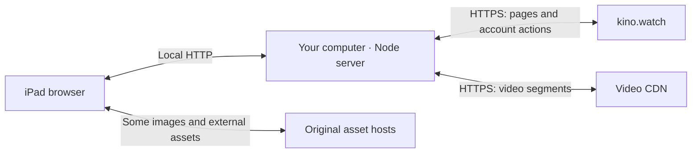

# kinopub-compat

Makes [Kinopub](https://kino.watch) usable on iOS 12 devices (for example, an
older iPad stuck on iOS 12). The modern Kinopub web app and its player rely on
browser features that iOS 12 Safari lacks, so this project runs a small local
server on your computer that serves the original Kinopub interface to the iPad
and swaps in a compatible video player.

Catalogs, search results, videos, bookmarks, watchlists, history, and account
operations all use the real service. There is no sample catalog or substitute
video library.

This is a **live gateway/client**, not an independent copy of Kinopub's proprietary
backend. An internet connection, a working kino.watch account, and any subscription
required by the service are still necessary. Original pages and assets are fetched
from the service, so changes or outages there can affect this client.

## Run

Install Node.js 22 or later, then run from this directory:

```sh
npm ci
npm start
```

Open **http://127.0.0.1:3000** on this computer. The server also prints its local
network address (for example, `http://192.168.x.x:3000`).
Open that address in Safari on an iPad connected to the same network, and log in
using the page. Keep the computer and server running while watching.

The default bind address is `0.0.0.0`, which allows devices on your local network
to connect. Each browser signs in separately. The server does not save passwords
or session cookies to disk. Upstream connections use HTTPS; the local listener
uses HTTP and is intended for a trusted private network.

```sh
# Restrict access to this computer:
HOST=127.0.0.1 npm start

# Use another port:
PORT=8080 npm start
```

If another device cannot connect, check that both devices use the same local
network, use the network address printed at startup (not `localhost`), and allow
Node through the computer's firewall if it prompts. Guest-network isolation can
also prevent device-to-device connections.

## iOS 12 playback

iOS 12 is detected automatically. Its pages omit the modern Vidstack player and
load the local compatibility player instead. The player uses Safari's native HLS
implementation, inline video, and native fullscreen/AirPlay when supported.
Video manifests and segments are relayed through the local server. AVC/H.264
variants are selected when available; alternate audio and subtitle groups remain
in the master playlist. This does not transcode a title that has no compatible
source codec.

The compatibility player provides play/pause, seeking, 10-second skips, speed,
quality, audio, subtitles, episode/season selection, autoplay-next, watched marks,
and resume. Account progress updates go to the original service. A per-account
browser-local resume position also protects against delayed upstream readback.
Native fullscreen, AirPlay, and picture-in-picture depend on device support.
For AirPlay or casting, open the app using the computer's LAN address so the
receiving device can reach its media URLs; `127.0.0.1` refers to the receiver itself.

To try this player on a current desktop browser, append `?compat=1` to a title URL.
The preference persists in that browser. Use `?compat=0` to return to automatic
device detection. Desktop compatibility playback uses hls.js so alternate audio
and subtitles work even in browsers with incomplete native HLS support.

## How it works

The implementation is a **local gateway with a browser-compatibility layer**.
Kinopub supplies the live application and account data; your computer adapts and
forwards them to the iPad.



### 1. Open the local address

Safari requests a page such as:

```text
http://192.168.x.x:3000/movie
```

The Node server requests the corresponding upstream page:

```text
https://kino.watch/movie
```

It forwards the request method, query parameters, relevant account cookies, and
any submitted form data. Kinopub performs the actual catalog lookup or account
operation.

### 2. Adapt the response

Before returning the page, the server rewrites links pointing to `kino.watch` so
subsequent navigation continues through the local server. For example:

```text
https://kino.watch/item/view/123/example
                      ↓
/item/view/123/example
```

Redirects receive similar treatment. Most of the interface remains the original
HTML, CSS, and JavaScript, which is why it closely matches the live website.

External URLs are generally preserved. Consequently, some posters, images, and
third-party assets load directly from their original hosts.

### 3. Establish a login session

When you submit the login form, the local server forwards it to Kinopub over
HTTPS. Kinopub validates your credentials and returns session cookies.

The proxy adjusts those cookies so the browser can use them on the local address.
Subsequent requests carry the session back through the proxy to Kinopub.

Each browser has its own session. The Node server does not save passwords or
login cookies to disk, although it necessarily handles them while forwarding
requests. The connection between your device and computer currently uses HTTP.

### 4. Apply iOS 12 compatibility changes

The server checks the browser's user-agent string. For iOS 12, it removes the
modern player scripts, adds the locally written compatibility player and styles,
injects a few browser API fallbacks, and attempts to translate proxied JavaScript
into Safari 12-compatible syntax.

The replacement player reads the same title and episode information supplied by
Kinopub, including its authorized video URLs. Newer devices normally retain the
original player.

### 5. Stream the video

When you press Play, the player requests an **HLS manifest**: a small text
document describing available qualities, audio tracks, subtitles, and video
segments.

The local server fetches that manifest and rewrites its media URLs into signed
local relay URLs:

```text
CDN segment URL
       ↓
/__local/media/<signature>/<encoded-url>
```

Safari then requests those local URLs. The server validates each signature,
fetches the corresponding CDN resource, and streams it back.

This happens repeatedly as playback progresses. The computer relays the
compressed video bytes; **the iPad decodes the video**. There is no video
transcoding or permanent movie download.

For legacy playback, the manifest is filtered to prefer available H.264/AVC
variants. Audio and subtitle references are preserved. If no suitable source
exists, the server cannot manufacture one.

### 6. Handle player and account actions

Play, pause, volume, speed, and seeking operate on the browser's video element.
Other actions involve the service:

| Action | What happens |
| --- | --- |
| Select another season | Fetch that season's real episode list through the proxy |
| Select an episode | Load its authorized HLS manifest |
| Add a bookmark | Forward the original account request to Kinopub |
| Mark an episode watched | Send an update to Kinopub |
| Save playback progress | Send progress upstream and save a browser-local fallback |

Account actions retain the site's CSRF protection. The proxy prevents
video-manifest responses from replacing the account page's CSRF cookie, which
would otherwise break bookmark requests.

### 7. Close and reopen the app

Login cookies remain in the browser according to their expiry. Player
preferences and fallback resume positions use browser local storage.

The server has no local catalog database and does not cache movies. It keeps
only a small in-memory cache of transformed JavaScript and the local player
files. Restarting it clears those caches and changes the media-signing key, so
an already-open video page may need reloading.

### Response speed

Pages are adapted in memory, so the work the server adds is measured in
milliseconds; transfer size is what usually decides how quickly an old iPad
finishes loading. Several behaviours keep that small:

- Pages, scripts, stylesheets, and playlists are sent compressed (Brotli or
  gzip) when the browser accepts it, which is roughly a 3–10x reduction.
- The service is asked for compressed bytes too, so the upstream fetch is
  smaller as well. Bodies are expanded locally only to be rewritten.
- The local player files, including `hls.js`, are read from disk once, kept
  compressed in memory, and carry an `ETag`, so reloads answer `304` instead of
  resending about 550 KB.
- Validators from the service are preserved on scripts and stylesheets, letting
  the browser reuse cached copies rather than refetch the site's assets on every
  page. Compiled files are tagged separately so the two variants never mix.
- Compiled JavaScript is cached by content hash, and a page's inline scripts are
  compiled concurrently.
- Video segments are streamed through untouched, with byte ranges and their
  original encoding preserved.

Your computer, the local server, your network connection, and kino.watch must
all remain available. The local additions provide compatibility and request
forwarding; the underlying catalog, permissions, and account services still
belong to Kinopub.

The main implementation is in [server.mjs](server.mjs),
[lib/transform.mjs](lib/transform.mjs), and
[public/compat-player.js](public/compat-player.js).

## Validation

```sh
npm test
npm run check
```

Tests cover device detection, cookie rewriting, local links, relay signature
validation, HLS variants/audio/subtitles/keys/segments, and ES5 syntax for locally
authored browser scripts. They also cover the transfer behaviour: documents
survive the compression round-trip unchanged, local player files revalidate with
a `304`, compiled scripts keep a validator distinct from the original bytes, and
relayed media and partial responses are passed through untouched. See
[VALIDATION.md](VALIDATION.md) for live browser checks and remaining device
verification.

`scripts/verify-webkit.mjs` is a one-shot verification harness, separate from the
app. It receives a test session through a loopback-only JSON request, keeps cookies
in memory, launches WebKit, and closes after returning results. It never writes
browser storage state. `WEBKIT_EXECUTABLE` can specify an existing WebKit binary.

## Files

- `server.mjs`: local HTTP server, upstream requests, sessions, document rewriting,
  media relay, and LAN startup.
- `lib/transform.mjs`: iOS detection, origin/cookie rewriting, signed media links,
  and compatible HLS manifests.
- `public/compat-player.js` and `.css`: compatible player and account integration.
- `public/compat.js`: browser API fallbacks for older Safari.
- `test/`: focused automated checks.

No external payments, comments, messages, or account settings are submitted by
the tests. Using those actions in the live interface operates on the real account.
